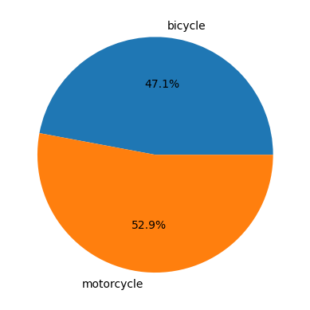

# Image classifier AWS-Workflow

Simple project classifying subset of images from CIFAR-100, trained and deployed using AWS services.

This project comes from the Udacity **AWS Machine Learning Engineer Nanodegree** course, project two. 
The starter pack for this project can be found here: 
(starter.ipynb[https://github.com/udacity/udacity-nd009t-C2-Developing-ML-Workflow/tree/master/project]. 
The main goal of this project is to learn how to use AWS services to orchestrate machine learning workflow.

## Technologies

*  AWS SageMaker AI
*  AWS Lambda
*  AWS StepFunctions

## Background

In the project's original description I act as a engineer working in *Scones Unlimited*:
> You are hired as a Machine Learning Engineer for a scone-delivery-focused logistics company, *Scones Unlimited*,
> and you’re working to ship an Image Classification model. [...]
> 
> In this project, you'll be building an image classification model that can automatically detect which kind of vehicle
> delivery drivers have, in order to route them to the correct loading bay and orders. 
> Assigning delivery professionals who have a bicycle to nearby orders and giving motorcyclists orders that are 
> farther can help Scones Unlimited optimize their operations.

The training and test data comes from CIFAR-100 dataset. 
I filter the images corresponding to classes "bicycle" and "motorcycle" and train a binary classifier.
Then the model is deployed with Data Capture configuration, which allows me to monitor the performance of the model.
This is all done in the notebook [starter.ipynb](starter.ipynb).

## The results

### Inference workflow

Once the endpoint is created, I can call the model to run inference on some sample test data. 
The inference is performed using three AWS Lambda functions:

* [ImageDataSerialize](lambda_functions/serialize/lambda_function.py): it reads an image (for a given filename) from S3 bucket and sends it as base64 encoded object,
* [ImageDataInference](lambda_functions/inference/lambda_function.py): it invokes the endpoint with the encoded image and runs the inference
* [ImageDataPassThreshold](lambda_functions/pass_threshold/lambda_function.py): it checks if the model's inference passes a required confidence threshold.
If not, it raises an error.

The three Lambda functions are orchestrated using AWS Step Functions:

<table>
  <tr>
    <td align="center">
       
      <em>Inference workflow when the image passes the confidence threshold</em>
    </td>
    <td align="center">
       
      <em>Inference workflow when the image doesn't pass the confidence threshold</em>
    </td>
  </tr>
</table>

The step function is declared [here](state_machine_definition.json).

### Optional challenge: parallel execution

The project defines an optional challenge:
> Modify your event driven workflow: can you rewrite your Lambda functions so that the workflow can process multiple
> image inputs in parallel? Can the Step Function "fan out" to accommodate this new workflow?

I found a StepFunctions' flow element called `Map`,
which allows me to map each item from a list of JSONs to a given workflow.
Each workflow is executed concurrently.

I used Distributed mode and set ToleratedFailurePercentage to 100,
which I found in this 
[AWS guide](https://docs.aws.amazon.com/step-functions/latest/dg/state-map-distributed.html).
This way it runs against all images and shows me a summary at the end.
If ToleratedFailurePercentage was 0, then it would stop the execution after first image
fell below the confidence threshold. 
Because each image in the image list is independent in my view,
I didn't want an error of one image to influence predictions of other images.

<table>
  <tr>
    <td align="center">
       
      <em>Distributed Map state machine</em>
    </td>
    <td align="center">
       
      <em>Distributed Map running over 5 sample images. Note that 3 of them fall below the confidence threshold and fail</em>
    </td>
  </tr>
</table>

The step function with parallel map is declared 
[here](./parallel_state_machine_definition.json).

### Monitor inference

#### Visualize model's confidence over time

I can plot confidence that the model has in predicting a given class. 
The confidence here is interpreted as the higher number in the inference array.
The dashed line marks the confidence threshold which is set in the "Check threshold" Lambda function to 0.9.

#### Show predictions for sample images

I think it's valuable to see what predictions are made for given images.
In the production version I would be most interested in seeing images for which the confidence is low,
to understand if the model is under-performing, or maybe it just gets bad data.
Below you can see one example when the model is very confident, and one example when it's not.
Please note that for 2-class classifier 64% confidence is quite low.

<table>
  <tr>
    <td align="center">
       
      <em>Image which makes the model is very confident</em>
    </td>
    <td align="center">
       
      <em>Image which falls below the confidence threshold</em>
    </td>
  </tr>
</table>

#### Visualize class imbalance

I think that a very useful metric is class imbalance. 
It can help detecting model/data drift, 
when the proportion of each class predictions would deviate from an assumed distribution.
For the CIFAR-100 dataset I expect the class proportion to be roughly 50% - 50%.

Below you can see a proportion of predicted classes after sending a few sample images via the state machine.

*Proportion of predicted classes*