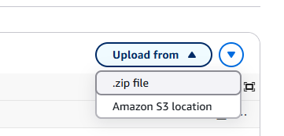

# Inference Lambda function

## Problem description

I use SageMaker SDK inside the Lambda function to invoke the predictor, namely:
```python
 # Instantiate a Predictor
predictor = sagemaker.predictor.Predictor(ENDPOINT)

# For this model the IdentitySerializer needs to be "image/png"
predictor.serializer = IdentitySerializer("image/png")

# Make a prediction:
inferences = predictor.predict(image)
```

However, default Lambda python image doesn't contain SageMaker.
According to the Udacity project's objective, I should create a `package/` folder with all the required dependencies,
create a .zip archive and upload it to the Lambda function:



I followed the official guide: 
[Working with .zip file archives for Python Lambda functions](https://docs.aws.amazon.com/lambda/latest/dg/python-package.html#python-package-create-with-dependency).
Because I was working in SageMaker AI Studio, 
for my convince I tried to create the dependency package in the Studio terminal.
However, my Lambda always failed while importing the `sagemaker` package, 
and I couldn't find a right combination of packages version. 
It either complained about `numpy`, or `rpds`, or `jsonschema`...

## Solution
I eventually decided to build the package inside a docker container with official AWS Lambda python image. 
I also added the dependency as a layer. That's because if I added it with "Upload from" it said the package is too big
and it couldn't display `lambda_function.py`. I found it quite inconvenient.  